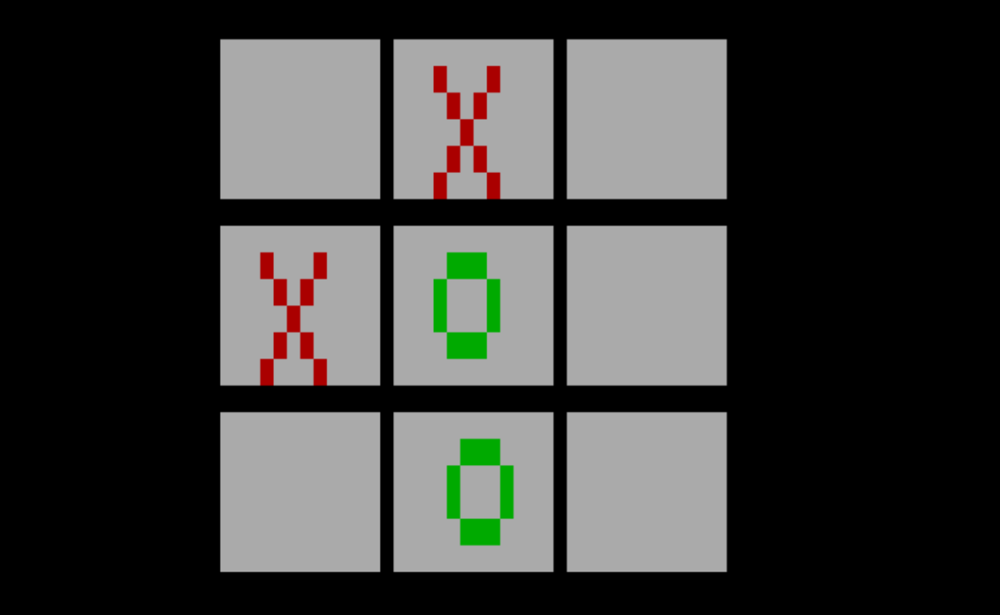

# tictactoe-x86
A classic Tic Tac Toe game implemented in x86 assembly

Two players alternate turns to place X and O symbols on a 3×3 grid using number keys 1–9 to select cells:
- Keys 1–3 → top row  
- Keys 4–6 → middle row  
- Keys 7–9 → bottom row

preview:
